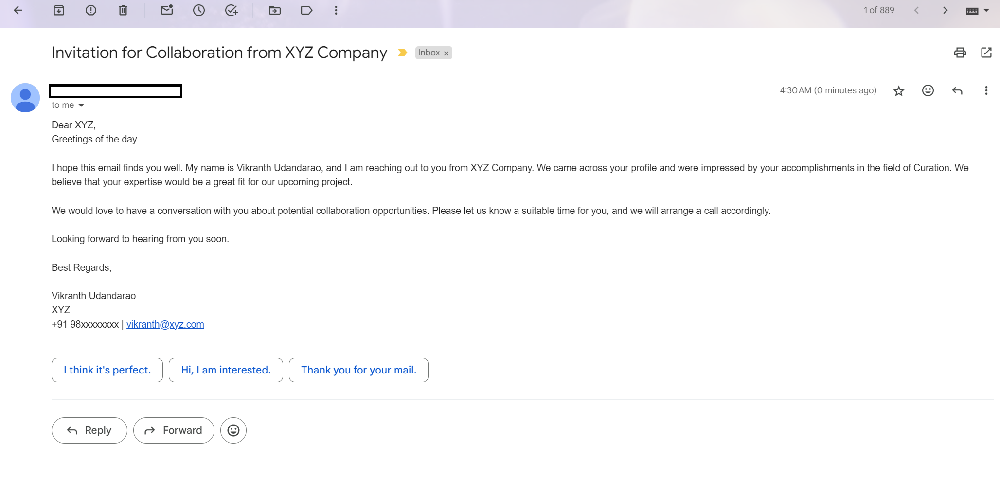

# Spreadsheat-Email-Automation

This project uses Google Apps Script to automate the process of sending personalized emails based on data in a Google Spreadsheet. The script reads the data from the spreadsheet, constructs personalized email messages, and sends them out using Gmail. This can be particularly useful for sending bulk emails, such as event invitations or newsletters, with personalized content for each recipient.

## How It Works

The script reads data from specific columns in the Google Spreadsheet, where each row represents a different recipient. The data includes the recipient's name, email address, and other relevant information.

The script then constructs a personalized email for each recipient using this data. The email includes a greeting, an invitation to the event, and other details.

Finally, the script uses the Gmail service to send the email to each recipient.

## Setup

1. Create a new Google Spreadsheet and fill it with your data. The first column should contain the recipient's name, the second column should contain the recipient's email address, and the third column should contain the category or other relevant information.

2. Open the script editor by clicking on "Extensions" > "Apps Script."

3. Delete any code in the script editor and replace it with the code from this repository.

4. Save the project with a new name.

5. Run the `sendMail` function to send the emails.

Please note that you may need to authorize the script to send emails on your behalf. You'll be prompted to do this the first time you run the script.

## Contributing

Welcome to contribute to Spreadsheet-Email-Automation! Feel free to fork the repository and suggest any improvements. To contribute, follow these steps:

1.  Fork the repository.
2.  Create a new branch for your feature or bug fix.
3.  Make your changes and commit them.
4.  Push the changes to your fork.
5.  Submit a pull request.

Thank you for your contributions!

## License

This project is licensed under the [MIT License](LICENSE).
